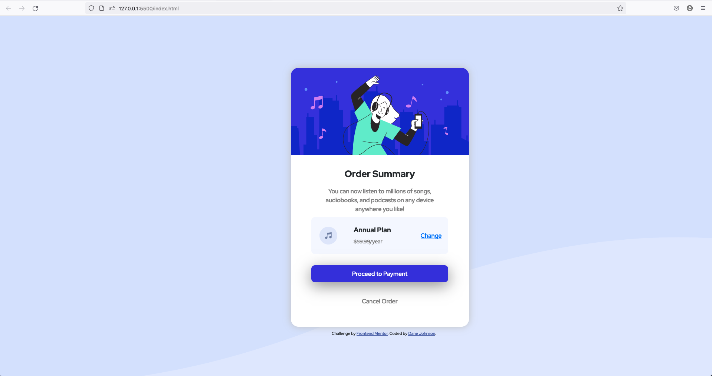

# Frontend Mentor - Order summary card solution

This is a solution to the [Order summary card challenge on Frontend Mentor](https://www.frontendmentor.io/challenges/order-summary-component-QlPmajDUj). Frontend Mentor challenges help you improve your coding skills by building realistic projects. 

## Table of contents

- [Overview](#overview)
  - [The challenge](#the-challenge)
  
  -[Links](#livesite)
  - [Screenshot](#screenshot)
- [My process](#my-process)
  - [Built with](#built-with)
  - [What I learned](#what-i-learned)
  - [Continued development](#continued-development)
  - [Useful resources](#useful-resources)
- [Author](#author)
- [Acknowledgments](#acknowledgments)

## Overview

### The challenge

Users should be able to:

- See hover states for interactive elements

### Links

Live Solution Site - (https://titojohnkc.github.io/ordersummarycard/)

### Screenshot

Desktop - main-desktop-screenshot

## My process

### Built with

- Semantic HTML5 markup
- CSS custom properties
- Bootstrap 5.1

### What I learned

I learned that I don't fully understand the mobile first work flow.

### Continued development

Points to note going forward:
- Work on Mobile First - Workflow
- Learn to keep my CSS code cleaner.
- Learn to keep track of classes and find a better workflow to create classes as needed.

### Useful resources

-[CSS Validator](https://jigsaw.w3.org/css-validator/) - This resource assisted me to ensure that my written code meets CSS3 + SVG standards.

-[HTML Validator](https://validator.w3.org/) - This resource validated my HTML code to verify that I followed HTML5 standards.

## Author

- Frontend Mentor - [@titojohnkc](https://www.frontendmentor.io/profile/titojohnkc)
- Twitter - [@dane_vajohnson](https://www.twitter.com/dane_vajohnson)

## Acknowledgments

-Skills and workflows used towards this challenge were learned from udemy.com Angela Yu 2021 Web Development Workshop
